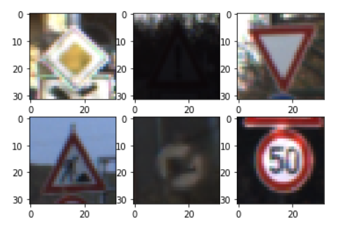

## Project: Build a Traffic Sign Recognition Program

Overview
---

This project implements a Convolutional Neural Network using Tensorflow and python 3.5. The network was based on the LeNet-5 architecture and uses the [German Traffic Sign Dataset](http://benchmark.ini.rub.de/?section=gtsrb&subsection=dataset) to train and classify road signs (download bellow). 

A more in-depth explanation can be found [here](https://github.com/dhiegomaga/Traffic-Sign-Classifier-Project/blob/master/writeup.md)

### External files

The dataset used to run the code can be download at (direct link)

* [Download Dataset](https://s3-us-west-1.amazonaws.com/udacity-selfdrivingcar/traffic-signs-data.zip)

(size: around 100 MB).

