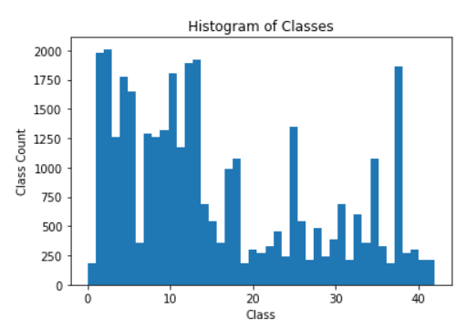
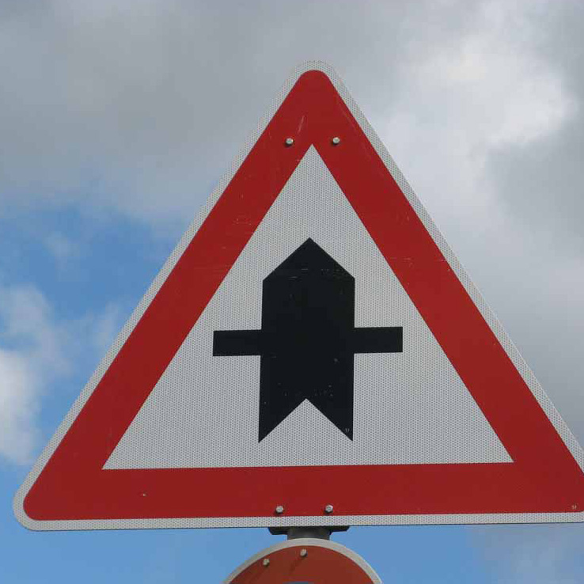
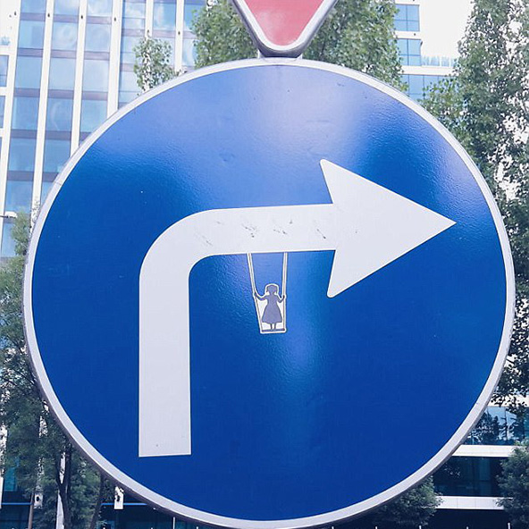
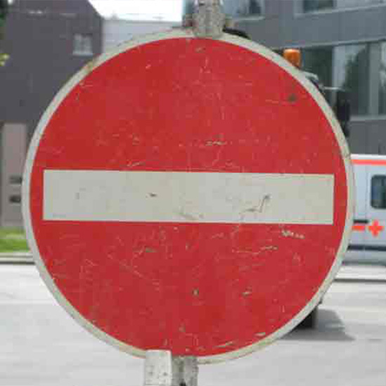
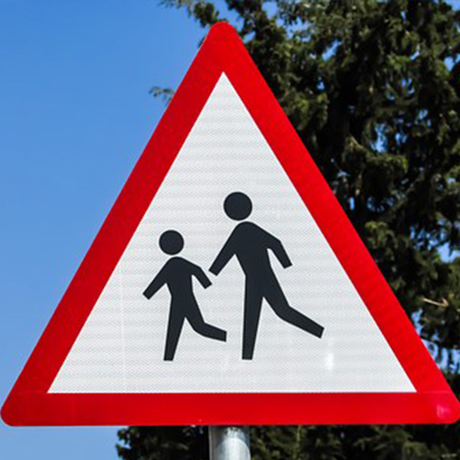

# **Traffic Sign Recognition** 

## Detailed explanation

**Build a Traffic Sign Recognition Project**

The goals / steps of this project are the following:
* Load the data set (see below for links to the project data set)
* Explore, summarize and visualize the data set
* Design, train and test a model architecture
* Use the model to make predictions on new images
* Analyze the softmax probabilities of the new images
* Summarize the results with a written report

### Data Set Summary & Exploration

Dataset specifications:

* 34799 training images.
* 4410 validation images. 
* 12630 test images.
* Image shape: (32, 32, 3)
* Number of classes: 43 (defined inside signnames.csv)

#### 2. Dataset visualization

Bellow we see a visualization of some iamges of the dataset, as well as a histogram containing the number of instances of each class. 

### Design and Test a Model Architecture

#### Data normalization

We normalize the RGB images from the [0 .. 255] range to [-1.0 .. 1.0]. This is useful when training neural networks because it keeps its mean at 0. 

#### Network architecture

The network is based on LetNet-5, with a dropout at the last fully connected layer. 

| Layer         		|     Description	        					| 
|:---------------------:|:---------------------------------------------:| 
| Input         		| 32x32x3 RGB image   							| 
| Convolution 5x5     	| 1x1 stride, VALID padding, outputs 28x28x6 	|
| RELU					|												|
| Max pooling	      	| 2x2 stride,  outputs 14x14x6				    |
| Convolution 5x5	    | 1x1 stride, VALID padding, outputs 10x10x16   |
| Fully connected		| Outputs 120       							|
| RELU				    |         									    |
| Fully connected	    | Outputs 84									|
| RELU					| 											    |
| DROPOUT               | keep-rate: 0.75                               |
| Fully connected       | Outputs 43                                    |
 

#### Training parameters

Learning rate was set to lr = 0.001, epochs = 10 and batch_size = 128. When initializing the parameters, truncated normal was used for the weights, with a mean of 0 and sigma = 0.1. 

Softmax is applied after the last layer pass, and then the cross entropy is computed using the one-hot encoded y-labels. This is done via the *tf.nn.softmax_cross_entropy_with_logits()* function. The loss is set as the mean os the cross entropy. 

The optmizer used is the Adam Optimizer ( *tf.train.AdamOptimizer()* ).

#### Training, validation and testing results

To increase model robustness, a dropout layer with keep_rate of 0.75 was added to the final FC layer. It was also observed that after 10 epochs, the validation accuracy often started decreasing. This is probably due to overfitting on the training set. A learning rate of 0.001 was found to yield satisfactory results. Values bigger than this caused the model to become more unstable (varying the accuracy up and down after some point) and smaller values took longer to train without significant improvement. 

The final model results were:
* training set accuracy of 0.997
* validation set accuracy of 0.934
* test set accuracy of 0.924

### Test a Model on New Images

#### Test on external images

Five German traffic signs found on the web were tested against the trained model:

     

Here are the results of the prediction:

| Image			        |     Prediction	        			                		| 
|:---------------------:|:-------------------------------------------------------------:| 
| Right-of-way at the next intersection	   | Right-of-way at the next intersection      | 
| Turn right ahead     			           | Turn right ahead 							|
| No entry					               | No entry									|
| Road work	      		                   | Road work					 				|
| Children crossing		                   | Children crossing    	|

The model was able to correctly guess 5 of the 5 traffic signs, which gives an accuracy of 100%. This compares reasonably close to the test accuracy of 92.4%, even though this sample size is much smaller (only 5 images). 

The confidence of each classification is shown bellow. They can also be found in the last cell of the jupyter notebook. 

First image (Right-of-way at the next intersection): 

| Probability         	|     Prediction	        					| 
|:---------------------:|:---------------------------------------------:| 
| 1.0         			| Right-of-way at the next intersection   									| 
| .00     				| - 										|
| .00					| -											|
| .00	      			| -					 				|
| .00				    | -      							|

Second image (Turn right ahead): 

| Probability         	|     Prediction	        					| 
|:---------------------:|:---------------------------------------------:| 
| .93         			| Turn right ahead   									| 
| .07     				| Turn left ahead 										|
| .001					| Beware of ice/snow					|
| .00	      			| -					 				|
| .00				    | -      							|

Third image (No entry): 

| Probability         	|     Prediction	        					| 
|:---------------------:|:---------------------------------------------:| 
| 1.0         			| No entry   									| 
| .00     				| -										|
| .00					| -											|
| .00	      			| - 					 				|
| .00				    | -       							|

Fourth image (Road work): 

| Probability         	|     Prediction	        					| 
|:---------------------:|:---------------------------------------------:| 
| 0.99         			| Road work   									| 
| .0001     			| Speed limit (80km/h) 							|
| .00					| -											|
| .00	      			| -					 				|
| .00				    | -      							|

Fifth image (Children crossing): 

| Probability         	|     Prediction	        					| 
|:---------------------:|:---------------------------------------------:| 
| .99         			| Children crossing   						| 
| .0002     			| End of no passing 							|
| .0002					| Slippery road								|
| .00	      			| -				 				   |
| .00				    | -      							|

